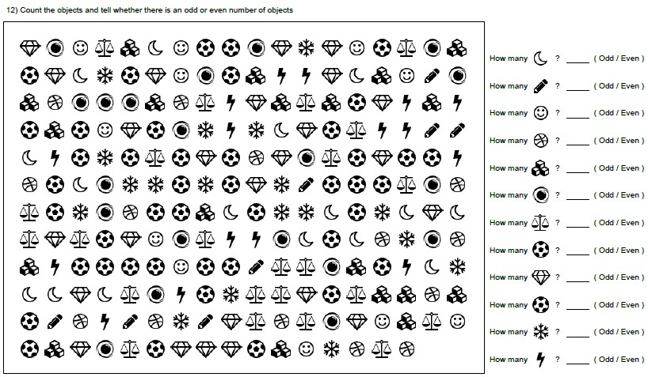

## Kids Worksheet Generator

### Look and Find - look_and_find.py
Objects counting and odd even identification
+ use png files under asserts/png

## Resources
+ [math-worksheet-generator](https://github.com/januschung/math-worksheet-generator)
+ [Font-Awesome-SVG-PNG](https://github.com/Rush/Font-Awesome-SVG-PNG)
